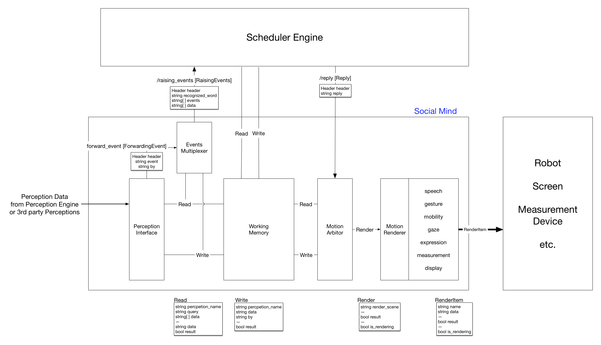

# Social Mind
## Overview

Social HRI Software Framework - Social Mind - is the modularized HRI software framework for developing the social robots. The framework is modularized by each function such as sensory perception, social perception, social mind, dialog, motion arbiter and motion renderer. Each module sends and receives the information (event, data) with each other using the ROS topic, service and actionlib.

## Installation (by sources)

        $ cd ~/catkin_ws/src
        $ git clone https://github.com/byeongkyu/social_mind.git
        $ rosdep install --from-paths social_mind --ignore-src -r -y
        $ cd social_mind
        $ find -name 'requirements.txt' | xargs -L 1 sudo pip install -U -r 
        

## Topics

### /raising_events [RaisingEvents.msg] via [events_multiplexer](./events_multiplexer)

* Type

        Header header
        string recognized_word
        string[] events
        string[] data

  * Example: Speech Recognition

        header:
            seq: 12
            stamp:
            secs: 1505344152
            nsecs: 513442993
            frame_id: ''
        recognized_word: Hello
        events: ['speech_recognized']
        data: ['{"confidence": 1.0, "recognized_word": "Hello"}']

  * Example: Button Input

        header:
            seq: 52
            stamp:
            secs: 1505344319
            nsecs:  13427972
            frame_id: ''
        recognized_word: ''
        events: ['button_pressed']
        data: ['{"text": "yes"}']

### /reply [Reply.msg] received from Scheduler Engine

* Type

        Header header
        string reply

* Format

  * Say

        header:
            seq:
            stamp:
            secs:
            nsecs:
            frame_id: ''
        reply: "Hello. My name is Silbot"

  * Say with gesture by tag

        header:
            seq:
            stamp:
            secs:
            nsecs:
            frame_id: ''
        reply: "<sm=tag:neutral> Hello. My name is Silbot"

  * Say with gesture by specific motion

        header:
            seq:
            stamp:
            secs:
            nsecs:
            frame_id: ''
        reply: "<sm=play:sm/open/1> Hello. My name is Silbot"

  * Say with expession

        header:
            seq:
            stamp:
            secs:
            nsecs:
            frame_id: ''
        reply: "<expression=happiness> Hello. My name is Silbot"

_Tag and Gesture List for Robots typically can find in each robot's render_gesutre package: motions.yaml_

[RaisingEvents.msg]: https://raw.githubusercontent.com/byeongkyu/social_mind/master/mind_msgs/msg/RaisingEvents.msg

[Reply.msg]: https://raw.githubusercontent.com/byeongkyu/social_mind/master/mind_msgs/msg/Reply.msg
